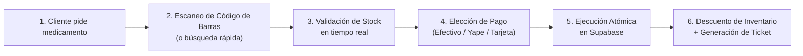

# FarmaApp — Guía Práctica del Proyecto
> **Sistema Móvil de Punto de Venta y Control de Inventario Farmacéutico en Tiempo Real**  
> *Documento Ejecutivo y Operativo para Presentación y Continuidad del Proyecto*

---

## 1. ¿Qué es FarmaApp y qué fue lo que hicimos?

**FarmaApp** es una solución integral diseñada para transformar cualquier teléfono celular Android en un **Terminal Punto de Venta (POS)** inteligente y autónomo para boticas y farmacias.

Elimina la necesidad de computadoras de escritorio lentas o pistolas láser costosas, permitiendo al farmacéutico atender al cliente en el mostrador directamente con su teléfono.

```
┌────────────────────────────────────────────────────────────────────────┐
│                          ARQUITECTURA DEL SISTEMA                      │
├─────────────────────────┬──────────────────────────────────────────────┤
│ Frontend Móvil          │ React Native + Expo SDK 51 + TypeScript      │
│ Interfaz de Usuario     │ Diseño minimalista, limpio, sin distracciones│
│ Base de Datos & Backend │ Supabase (PostgreSQL en la Nube)             │
│ Motor de Escaneo        │ Cámara nativa del móvil + Motor ZXing        │
│ Entregable Final        │ Archivo APK compilado (FarmaApp.apk - 168 MB)│
└─────────────────────────┴──────────────────────────────────────────────┘
```

### Lo que construimos:
1. **Base de Datos Relacional en la Nube (Supabase):**
   - Tablas normalizadas para `categorias`, `productos`, `ventas` y `detalle_ventas`.
   - Políticas de seguridad por fila (**RLS - Row Level Security**) para proteger la información comercial.
   - Función atómica PL/pgSQL (`registrar_venta_atomica`) que ejecuta la venta y el descuento de inventario en una única transacción indivisible, evitando errores de duplicidad.
   - Catálogo de prueba precargado con **25 medicamentos reales** de alta rotación (Paracetamol, Amoxicilina, Ibuprofeno, etc.) con sus precios en Soles (S/) y niveles de stock.

2. **Aplicación Móvil Android:**
   - **Módulo de Inicio:** Métricas del día, accesos rápidos y estado de sincronización con la base de datos.
   - **Módulo de Búsqueda:** Filtro reactivo en tiempo real por nombre, principio activo o código con selectores por categoría.
   - **Módulo de Escáner:** Uso de la cámara del dispositivo con mira visual para capturar códigos de barras en 0.5 segundos.
   - **Módulo de Venta y Carrito:** Resumen detallado, cálculo automático de Subtotal e IGV (18%), métodos de pago (Efectivo, Yape, Plin, Tarjeta) y confirmación de venta con comprobante correlativo.

3. **Herramientas de Soporte y Pruebas:**
   - Generación de **25 códigos de barra reales en formato PNG** (`BOT-000001` al `BOT-000025`) listos para ser leídos o impresos.
   - **Simulador Interactivo para Computadora** con soporte para Cámara Web (Webcam) utilizando el motor industrial `ZXing` para pruebas inmediatas en pantalla.
   - Galería móvil de códigos para proyectar desde el celular.
   - **Archivo `FarmaApp.apk` compilado de forma 100% nativa** en tu máquina, listo para instalar en cualquier teléfono Android sin depender de internet para la instalación.

---

## 2. ¿Qué problemas reales resolvemos con esto?

En la operación diaria de una botica tradicional existen fricciones constantes que hacen perder ventas y dinero:

### 🔴 Problema 1: Colas largas y lentitud en mostrador
* **Situación:** El farmacéutico tiene que ir a la computadora, escribir el nombre del producto letra por letra, seleccionar la presentación correcta entre docenas de opciones parecidas y recién cobrar.
* **Solución FarmaApp:** El farmacéutico agarra la caja del medicamento, apunta la cámara del teléfono y en **menos de 1 segundo** el producto ya está en el carrito con su precio exacto.

### 🔴 Problema 2: Errores humanos de digitación o cobro
* **Situación:** Confundir presentaciones (por ejemplo cobrar Paracetamol 500 mg cuando el cliente llevó Paracetamol Forte 1g), o cobrar precios desactualizados.
* **Solución FarmaApp:** El código de barras `Code128` es unívoco. No hay margen de error humano: el código escaneado corresponde exactamente al precio y presentación registrados en la base de datos central.

### 🔴 Problema 3: "Stock fantasma" y descuadre de inventario
* **Situación:** Dos cajeros intentan vender el último blíster disponible al mismo tiempo. El sistema tradicional permite venderlo dos veces y luego no hay medicamento para entregarle al cliente.
* **Solución FarmaApp:** Nuestra función atómica en PostgreSQL usa bloqueo por fila (`FOR UPDATE`). Si hay 1 en stock y dos cajeros confirman al mismo tiempo, el primer cajero lo vende y al segundo el sistema le frena la venta inmediatamente con la alerta: *"Stock insuficiente"*.

### 🔴 Problema 4: Dependencia de hardware costoso
* **Situación:** Comprar computadoras completas, pistolas lectoras láser USB y licencias caras de software POS para cada mostrador.
* **Solución FarmaApp:** Cualquier teléfono Android que ya tenga el farmacéutico o el dueño del negocio se convierte de inmediato en un terminal de cobro profesional.

---

## 3. ¿Cómo funciona la app? (Flujo Operativo Paso a Paso)



### Paso 1: Identificación del Producto
El farmacéutico abre FarmaApp y tiene 3 formas inmediatas de ingresar el producto:
1. **Por Escáner:** Presiona el botón central "Escanear", enfoca la caja del medicamento y el sonido (*beep*) confirma la lectura.
2. **Por Búsqueda Manual:** Escribe "Amo" o "Para" en el buscador y el sistema filtra al instante mostrando fotos, stock disponible y categoría.
3. **Por Código Directo:** Si el código está borroso o roto, escribe `BOT-000001` manualmente.

### Paso 2: Control Visual de Inventario en el Carrito
Cada medicamento agregado muestra una etiqueta clara de estado:
* 🟢 **Disponible:** Hay stock suficiente.
* 🟡 **Bajo:** Quedan pocas unidades (cerca del stock mínimo).
* 🔴 **Agotado:** El sistema bloquea el botón "+" impidiendo vender unidades inexistentes.

### Paso 3: Liquidación y Pago
En la pantalla de cobro:
1. Se desglosa automáticamente:
   - **Subtotal** (Base imponible).
   - **IGV (18%)** calculado de forma transparente.
   - **Total a Pagar en Soles (S/)**.
2. Se selecciona el canal de pago: **Efectivo**, **Yape**, **Plin** o **Tarjeta**.

### Paso 4: Cierre de Transacción Atómica
Al presionar **"Confirmar Venta"**:
1. La aplicación envía el paquete JSON con los productos a Supabase.
2. La base de datos descuenta el stock en milisegundos.
3. Se genera un correlativo único con formato estándar:  
   `VTA-AAAAMMDD-0001` (ejemplo: `VTA-20260926-0001`).
4. Aparece la ventana de éxito confirmando la operación y el carrito queda limpio para atender al siguiente cliente.

---

## 4. ¿Cuál será nuestro siguiente paso? (Roadmap del Proyecto)

Habiendo alcanzado la versión funcional completa con base de datos en vivo y APK compilado, las siguientes etapas para llevar el proyecto al siguiente nivel comercial son:

### 🚀 Etapa 1: Impresión de Tickets Térmicos (Inmediato)
* **Objetivo:** Imprimir el ticket de venta físico para entregarlo al cliente.
* **Implementación:** Conectar la app por **Bluetooth** a una impresora térmica portátil de 58 mm o 80 mm (de las económicas que se usan con celular) para imprimir el comprobante con fecha, productos, subtotal, IGV y código QR de validación.

### 🚀 Etapa 2: Control de Usuarios, Cajeros y Turnos (Seguridad)
* **Objetivo:** Saber qué vendedor atendió cada venta y controlar el dinero de la caja.
* **Implementación:**
  - Login con usuario y contraseña (vía Supabase Auth).
  - Apertura de caja chica con monto inicial.
  - Cierre de turno y arqueo de caja (cuánto entró en efectivo vs Yape vs tarjeta).

### 🚀 Etapa 3: Alertas Inteligentes de Abastecimiento (Gestión de Compras)
* **Objetivo:** Que la farmacia nunca se quede sin medicamentos clave.
* **Implementación:**
  - Envío automático de alerta o correo al administrador cuando un producto llegue a su stock mínimo.
  - Sugerencia automática de pedido de reposición a proveedores/laboratorios.

### 🚀 Etapa 4: Facturación Electrónica SUNAT (Formalización)
* **Objetivo:** Emitir Boletas de Venta Electrónicas y Facturas con validez tributaria en Perú.
* **Implementación:** Integrar una API de Facturación Electrónica (como Nubefact o PSE autorizado) para que al confirmar la venta se genere el XML firmado y el CDR de SUNAT.

### 🚀 Etapa 5: Panel Web Administrativo (Dashboard)
* **Objetivo:** Que el dueño de la botica pueda ver el negocio desde su laptop o casa.
* **Implementación:** Un panel web simple conectado a la misma base de datos de Supabase para ver gráficos de ganancias del mes, medicamentos más vendidos y reporte de inventario valorizado.

---

## 5. Resumen de Archivos Clave del Proyecto

Si necesitas consultar o compartir los archivos principales del proyecto, aquí están sus ubicaciones exactas:

* 📱 **Instalador APK para Android:** [`d:\gest. proyec\app\FarmaApp.apk`](file:///d:/gest.%20proyec/app/FarmaApp.apk)
* 🖥️ **Simulador con Cámara Web:** [`http://localhost:3000`](http://localhost:3000) (ejecutado con `node scripts/serve-preview.js`)
* 📲 **Galería Móvil de Códigos para Celular:** [`http://192.168.18.4:3000/barcodes`](http://192.168.18.4:3000/barcodes)
* 🗄️ **Scripts de Base de Datos PostgreSQL:** [`database/schema.sql`](file:///d:/gest.%20proyec/app/database/schema.sql) y [`database/rpc.sql`](file:///d:/gest.%20proyec/app/database/rpc.sql)
* 📊 **Códigos de Barra de Prueba (PNG):** [`test-assets/barcodes/`](file:///d:/gest.%20proyec/app/test-assets/barcodes/)
