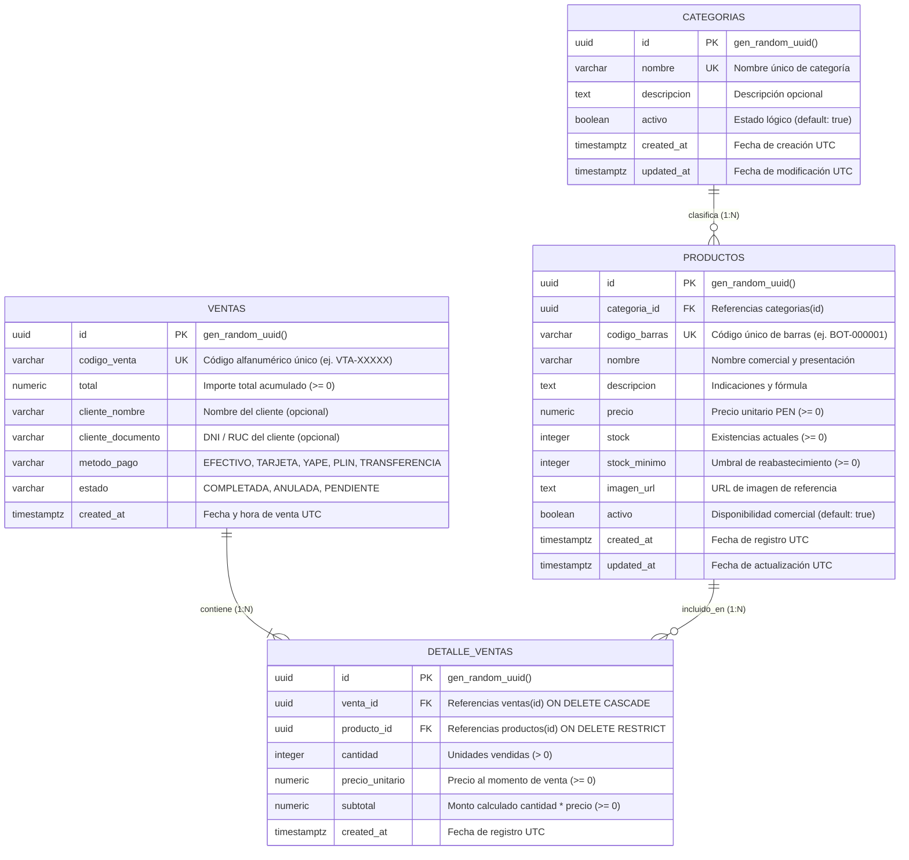
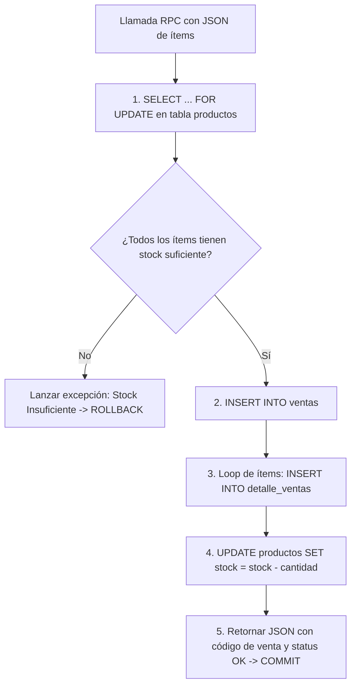

# FarmaApp - Arquitectura de Base de Datos y Diccionario de Datos

Este documento describe la arquitectura relacional, el esquema físico DDL, las políticas de seguridad (RLS), la atomicidad transaccional mediante RPC y el diccionario de datos implementado en **PostgreSQL / Supabase** para **FarmaApp**.

---

## 1. Diagrama Entidad-Relación (ERD)



---

## 2. Diccionario de Datos Físico

### 2.1. Tabla: `categorias`
Almacena las clasificaciones terapéuticas y comerciales de los productos farmacéuticos.

| Columna | Tipo de Dato | Nulable | Restricción / Default | Descripción |
| :--- | :--- | :---: | :--- | :--- |
| `id` | `UUID` | **NO** | `PRIMARY KEY DEFAULT gen_random_uuid()` | Identificador único universal de la categoría. |
| `nombre` | `VARCHAR(100)` | **NO** | `UNIQUE` | Denominación única (ej. *Analgésicos*, *Antibióticos*). |
| `descripcion` | `TEXT` | SÍ | `NULL` | Detalle o alcance terapéutico de la categoría. |
| `activo` | `BOOLEAN` | **NO** | `DEFAULT true` | Bandera lógica de activación comercial. |
| `created_at` | `TIMESTAMPTZ` | **NO** | `DEFAULT timezone('utc', now())` | Marca temporal de inserción. |
| `updated_at` | `TIMESTAMPTZ` | **NO** | `DEFAULT timezone('utc', now())` | Marca temporal de última modificación. |

---

### 2.2. Tabla: `productos`
Catálogo central de medicamentos, suministros médicos y artículos de cuidado personal.

| Columna | Tipo de Dato | Nulable | Restricción / Default | Descripción |
| :--- | :--- | :---: | :--- | :--- |
| `id` | `UUID` | **NO** | `PRIMARY KEY DEFAULT gen_random_uuid()` | Identificador único del producto. |
| `categoria_id` | `UUID` | **NO** | `REFERENCES categorias(id) ON DELETE RESTRICT` | Llave foránea a la categoría correspondiente. |
| `codigo_barras` | `VARCHAR(50)` | **NO** | `UNIQUE` | Código de barras legible ópticamente (ej. `BOT-000001`). |
| `nombre` | `VARCHAR(255)` | **NO** | — | Nombre comercial, concentración y presentación. |
| `descripcion` | `TEXT` | SÍ | `NULL` | Indicaciones farmacológicas o modo de uso. |
| `precio` | `NUMERIC(10,2)` | **NO** | `CHECK (precio >= 0)` | Precio de venta unitario en Soles Peruanos (PEN - S/). |
| `stock` | `INTEGER` | **NO** | `DEFAULT 0 CHECK (stock >= 0)` | Cantidad física disponible en inventario. |
| `stock_minimo` | `INTEGER` | **NO** | `DEFAULT 5 CHECK (stock_minimo >= 0)` | Límite para disparo de alerta de reposición. |
| `imagen_url` | `TEXT` | SÍ | `NULL` | URL de la imagen del producto para la interfaz móvil. |
| `activo` | `BOOLEAN` | **NO** | `DEFAULT true` | Habilitación en catálogo de ventas. |
| `created_at` | `TIMESTAMPTZ` | **NO** | `DEFAULT timezone('utc', now())` | Fecha de creación del registro. |
| `updated_at` | `TIMESTAMPTZ` | **NO** | `DEFAULT timezone('utc', now())` | Fecha de última actualización de datos/stock. |

---

### 2.3. Tabla: `ventas`
Encabezado de las transacciones comerciales realizadas en el punto de atención.

| Columna | Tipo de Dato | Nulable | Restricción / Default | Descripción |
| :--- | :--- | :---: | :--- | :--- |
| `id` | `UUID` | **NO** | `PRIMARY KEY DEFAULT gen_random_uuid()` | Identificador único de la transacción. |
| `codigo_venta` | `VARCHAR(30)` | **NO** | `UNIQUE` | Código legible de comprobante (ej. `VTA-20260925-1049`). |
| `total` | `NUMERIC(10,2)` | **NO** | `CHECK (total >= 0)` | Sumatoria total liquidada en Soles. |
| `cliente_nombre`| `VARCHAR(150)` | SÍ | `NULL` | Nombre del cliente atendido (opcional). |
| `cliente_documento`| `VARCHAR(20)` | SÍ | `NULL` | DNI o RUC del comprador (opcional). |
| `metodo_pago` | `VARCHAR(50)` | **NO** | `DEFAULT 'EFECTIVO' CHECK (metodo_pago IN (...))` | Forma de pago empleada (Efectivo, Tarjeta, Yape, Plin). |
| `estado` | `VARCHAR(30)` | **NO** | `DEFAULT 'COMPLETADA' CHECK (estado IN (...))` | Estado operativo de la venta (COMPLETADA, ANULADA). |
| `created_at` | `TIMESTAMPTZ` | **NO** | `DEFAULT timezone('utc', now())` | Fecha y hora exacta de la transacción. |

---

### 2.4. Tabla: `detalle_ventas`
Líneas de detalle discriminadas por cada producto que compone una venta.

| Columna | Tipo de Dato | Nulable | Restricción / Default | Descripción |
| :--- | :--- | :---: | :--- | :--- |
| `id` | `UUID` | **NO** | `PRIMARY KEY DEFAULT gen_random_uuid()` | Identificador único de la línea de detalle. |
| `venta_id` | `UUID` | **NO** | `REFERENCES ventas(id) ON DELETE CASCADE` | Llave foránea que agrupa el detalle a una venta. |
| `producto_id` | `UUID` | **NO** | `REFERENCES productos(id) ON DELETE RESTRICT` | Llave foránea al producto vendido. |
| `cantidad` | `INTEGER` | **NO** | `CHECK (cantidad > 0)` | Unidades adquiridas de dicho producto. |
| `precio_unitario`| `NUMERIC(10,2)` | **NO** | `CHECK (precio_unitario >= 0)` | Precio congelado al momento del cierre de venta. |
| `subtotal` | `NUMERIC(10,2)` | **NO** | `CHECK (subtotal >= 0)` | Importe liquidado para esta línea ($cantidad \times precio$). |
| `created_at` | `TIMESTAMPTZ` | **NO** | `DEFAULT timezone('utc', now())` | Fecha de creación del registro. |

---

## 3. Índices de Rendimiento

Para garantizar respuestas ultrarrápidas (< 500 ms) en la aplicación móvil, se crearon los siguientes índices especializados:

```sql
-- 1. Búsqueda instantánea por código de barras (usado por el escáner de cámara)
CREATE INDEX IF NOT EXISTS idx_productos_codigo_barras ON public.productos (codigo_barras);

-- 2. Búsqueda insensible a mayúsculas por nombre del fármaco
CREATE INDEX IF NOT EXISTS idx_productos_nombre_lower ON public.productos (lower(nombre));

-- 3. Filtrado compuesto por categoría y estado activo
CREATE INDEX IF NOT EXISTS idx_productos_categoria_activo ON public.productos (categoria_id, activo);

-- 4. Búsqueda de alertas de stock mínimo
CREATE INDEX IF NOT EXISTS idx_productos_stock_alerta ON public.productos (stock, stock_minimo);

-- 5. Búsqueda cronológica de ventas
CREATE INDEX IF NOT EXISTS idx_ventas_created_at ON public.ventas (created_at DESC);

-- 6. Consulta de detalle de venta por venta_id
CREATE INDEX IF NOT EXISTS idx_detalle_ventas_venta_id ON public.detalle_ventas (venta_id);
```

---

## 4. Políticas de Seguridad a Nivel de Fila (Row Level Security - RLS)

Todas las tablas cuentan con RLS habilitado (`ALTER TABLE ... ENABLE ROW LEVEL SECURITY;`), protegiendo el acceso a través del cliente público de Supabase:

* **Lectura Pública (`SELECT`):** Acceso libre a las tablas `categorias` y `productos` para permitir la consulta del catálogo y códigos de barra.
* **Escritura Controlada (`INSERT` / `UPDATE`):** Las ventas y descuentos de stock se realizan mediante la función RPC `registrar_venta_atomica`, la cual se ejecuta con privilegios de `SECURITY DEFINER`, evitando que un cliente móvil modifique directamente el inventario sin pasar por las validaciones de negocio.

---

## 5. Transacción Atómica de Venta (Función RPC PostgreSQL)

Para evitar condiciones de carrera (*race conditions*) y asegurar que una venta nunca descuente stock a medias o permita inventario negativo, se diseñó la función PL/pgSQL `registrar_venta_atomica`:



### Garantías ACID del Procedimiento
1. **Atomicidad:** Si ocurre un error al insertar cualquier detalle o actualizar un stock, toda la venta se revierte íntegramente (`ROLLBACK`).
2. **Consistencia:** Las restricciones `CHECK (stock >= 0)` impiden que el stock caiga por debajo de cero en cualquier circunstancia.
3. **Aislamiento:** El uso de `FOR UPDATE` bloquea temporalmente las filas de los productos involucrados mientras dura la transacción para impedir compras simultáneas que superen el saldo disponible.
4. **Durabilidad:** Una vez confirmado el `COMMIT`, los datos quedan persistidos permanentemente en el motor PostgreSQL de Supabase.
