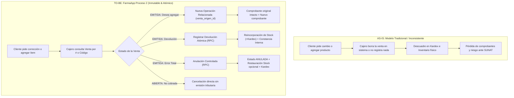
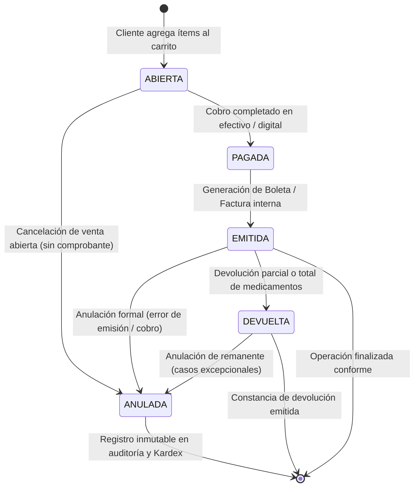

# FarmaApp — Proceso 2: Gestión y Corrección de Ventas

**Botica San Martín** · Sistema de Punto de Venta e Inventario Farmacéutico  
**Módulo:** Gestión de Ventas, Devoluciones, Anulación Controlada y Trazabilidad Operativa  
**Entrega:** Entrega 2  
**Estilo Visual:** *Clinical Apothecary Minimalist* (Bordado clínico, Inter tabular, radio 4px `Rounded.DEFAULT`, cero sombras decorativas)

---

## 1. Resumen Ejecutivo y Propósito

En una farmacia comunitaria o botica de alto tráfico, la atención al mostrador es rápida y dinámica. Con frecuencia se presentan situaciones posteriores al cobro:
1. El cliente pide **agregar otro producto** inmediatamente después de que su comprobante (Boleta o Factura) fue emitido.
2. El cliente solicita una **devolución parcial o total** (por medicamento equivocado, cambio de parecer o presentación incorrecta).
3. Ocurre un **error de digitación** en el importe, medio de pago o productos cobrados, requiriendo anulación.
4. Se suscitan **incidencias operativas** (descuadre, billete deteriorado, falla de red en billetera digital).

### Regla Fundamental de Negocio: Inmutabilidad de la Venta
> **¡Una venta emitida NUNCA se borra físicamente!**  
> `DELETE FROM ventas WHERE id = ...` está **estrictamente prohibido**.  
> El registro histórico, los ítems facturados y los movimientos de inventario deben permanecer inalterables para garantizar la trazabilidad contable, tributaria y el control de inventario en Kardex.

---

## 2. Diagramas de Proceso (Mermaid)

### 2.1 Flujo Operativo AS-IS (Tradicional / Deficiente) vs TO-BE (FarmaApp Proceso 2)



### 2.2 Ciclo de Vida y Transiciones de Estado de una Venta



---

## 3. Casos de Uso del Módulo (CU-01 a CU-04)

### CU-01: Consultar y Buscar Ventas Recientes
* **Actor:** Químico Farmacéutico / Cajero / Dueño de Botica.
* **Objetivo:** Localizar de manera ágil una transacción previa para consulta, reclamo o auditoría.
* **Criterios de Aceptación:**
  * Búsqueda reactiva insensible a mayúsculas por `# venta` (ej. `#000125`), código interno (`VTA-20260927-100001`), DNI o nombre del cliente.
  * Filtro por chips de estado: `Todas`, `Emitidas`, `Anuladas`, `Devueltas`.
  * Vista de lista con indicadores visuales (*Clinical Apothecary Status Chips*), hora, método de pago e importe total en Soles (S/).
  * Resumen del turno diario (KPIs de ventas realizadas, importe acumulado, devoluciones y anulaciones).

### CU-02: Devolución de Producto con Reincorporación a Stock
* **Actor:** Cajero / Químico Farmacéutico.
* **Condición Previa:** Venta en estado `EMITIDA` o `DEVUELTA` con saldo disponible de unidades.
* **Flujo:**
  1. El usuario selecciona la opción "Registrar Devolución".
  2. La pantalla presenta los productos vendidos, la cantidad original y las unidades ya devueltas previamente.
  3. El usuario indica la cantidad a retornar mediante selectores paso a paso (`-` / `+`), con validación de tope (no puede devolver más de lo vendido).
  4. La pantalla calcula en tiempo real:
     * **Previsualización de stock en almacén:** `Stock actual: N → Stock después: N + Cantidad devuelta`.
     * **Monto total a reintegrar:** `S/ XX.XX`.
  5. Se selecciona o especifica el motivo (*Medicamento equivocado, Empaque deteriorado, Cliente desistió, Reacción adversa*).
  6. Al confirmar, se invoca la función PL/pgSQL `registrar_devolucion_atomica(p_venta_id, p_items, p_motivo)`.
  7. La base de datos registra la devolución, actualiza el inventario en `productos`, inserta el movimiento tipo `DEVOLUCION` en `movimientos_stock` y emite el evento en `historial_ventas`.

### CU-03: Anulación Controlada de Operación
* **Actor:** Dueño de Farmacia / Supervisor.
* **Condición Previa:** Venta `EMITIDA`.
* **Regla de Negocio:** Una boleta emitida no se borra. La operación se marca como `ANULADA` y se registra el motivo de la anulación.
* **Flujo:**
  1. El usuario selecciona "Anulación Controlada".
  2. El sistema muestra la advertencia regulatoria de simulación/comprobante emitido.
  3. El usuario ingresa el motivo obligatorio (ej. *Error de cobro en tarjeta*, *Cliente no completó pago*).
  4. El usuario define si el stock debe retornar a inventario (`revertir_stock = true/false`, útil si el medicamento sufrió merma o rotura física).
  5. Se ejecuta el RPC `anular_venta_atomica(p_venta_id, p_motivo, p_revertir_stock)`.
  6. El inventario se restaura solo por las unidades que no hubiesen sido devueltas con anterioridad (`cant_a_revertir = vendida - devuelta`).

### CU-04: Registro de Incidencias Operativas
* **Actor:** Personal de turno.
* **Objetivo:** Documentar anomalías en una venta sin alterar sus importes (ej. billete falso detectado a posteriori, reclamo de vuelto, lote con observación).
* **Flujo:** Se invoca `registrar_incidencia_venta` indicando tipo (`ERROR_DIGITACION`, `MEDIO_PAGO`, `RECLAMO_PRODUCTO`, `CORRECCION`) y descripción detallada.

### Flujo Especial: "Cliente desea agregar otro producto a una venta ya cerrada"
1. El comprobante original (Boleta #000125) ya se encuentra emitido y permanece inalterado.
2. El cajero pulsa "Agregar Producto (Operación Relacionada)".
3. El sistema inicia una nueva transacción en el carrito vinculando `venta_origen_id = id_original`.
4. Al concretar la venta adicional, se emite un nuevo comprobante vinculado, conservando la trazabilidad de ambas operaciones.

---

## 4. Arquitectura de Base de Datos (PostgreSQL en Supabase)

### 4.1 Tablas Implementadas

| Tabla | Propósito | Llaves Foráneas / Índices |
|---|---|---|
| `public.ventas` | Cabecera inmutable de venta. Columnas añadidas: `numero_venta`, `subtotal`, `comprobante_tipo`, `comprobante_serie`, `comprobante_numero`, `venta_origen_id`. | Índice en `codigo_venta`, `numero_venta`, `created_at`. Check constraint en `estado`. |
| `public.detalle_ventas` | Líneas de producto vendidas (inmutables). | `venta_id → ventas(id)`, `producto_id → productos(id)`. |
| `public.devoluciones` | Cabecera de devoluciones con código correlativo `DEV-YYYYMMDD-XXXXXX`. | `venta_id → ventas(id)`. |
| `public.detalle_devoluciones` | Ítems devueltos, cantidades y subtotales reembolsados. | `devolucion_id → devoluciones(id)`, `producto_id → productos(id)`. |
| `public.movimientos_stock` | Kardex farmacéutico formal. Registra: `VENTA`, `DEVOLUCION`, `ANULACION`, `AJUSTE`, `RECEPCION`. | `producto_id → productos(id)`. |
| `public.incidencias_ventas` | Bitácora de incidencias operativas asociadas a la venta. | `venta_id → ventas(id)`. |
| `public.historial_ventas` | Timeline de auditoría cronológica (`VENTA_REGISTRADA`, `DEVOLUCION_REGISTRADA`, `ANULACION_VENTA`). | `venta_id → ventas(id)`. |

### 4.2 Funciones Almacenadas (RPC Transaccionales ACID)

1. **`registrar_devolucion_atomica(p_venta_id UUID, p_items JSONB, p_motivo TEXT) RETURNS JSONB`**
   * Valida existencia y estado de la venta (`FOR UPDATE`).
   * Verifica que las cantidades a devolver no excedan el saldo neto vendido.
   * Reincorpora el stock en `productos`.
   * Inserta movimientos en `movimientos_stock` (Kardex: `DEVOLUCION`).
   * Actualiza el estado de la venta a `DEVUELTA`.
   * Registra el evento en `historial_ventas`.

2. **`anular_venta_atomica(p_venta_id UUID, p_motivo TEXT, p_revertir_stock BOOLEAN) RETURNS JSONB`**
   * Valida que la venta no esté previamente anulada.
   * Si `p_revertir_stock = true`, calcula `cantidad - ya_devuelto` por cada producto e incrementa el stock de `productos`.
   * Registra movimientos tipo `ANULACION` en `movimientos_stock`.
   * Cambia el estado a `ANULADA`.
   * Registra en `historial_ventas` y en `incidencias_ventas`.

3. **`obtener_resumen_diario(p_fecha DATE) RETURNS JSONB`**
   * Computa KPIs para el dueño de la botica: ventas realizadas, total cobrado en Soles, ventas anuladas, conteo de devoluciones y unidades vendidas vs devueltas.

4. **`registrar_venta_atomica(p_items JSONB, ...)` (Actualizado)**
   * Admite vinculación con `venta_origen_id`.
   * Genera correlativo formal `#XXXXXX`.
   * Registra automáticamente en `movimientos_stock` (`VENTA`) y en `historial_ventas`.

---

## 5. Diseño: Clinical Apothecary Minimalist

El módulo aplica estrictamente el sistema de diseño definido:
* **Canvas Blanco y Superficies Pulcras:** Fondo `#ffffff` / `#f8f9ff`, tarjetas con bordes quirúrgicos `#cbd5e1` sin sombras decorativas flotantes.
* **Tinta Quirúrgica y Jerarquía de Texto:** Títulos en `#0b1c30`, subtítulos en `#45464d`, etiquetas de código en fuente monoespaciada tabular.
* **Acentos Funcionales Restringidos:**
  * **Verde Quirúrgico / Teal Confirm:** `#006a61` / `#0d9488` para confirmaciones de devolución, badges de ventas emitidas y botones afirmativos.
  * **Carmesí Clínico:** `#be123c` / `#ba1a1a` reservado exclusivamente para advertencias críticas, estado `ANULADA` y montos de reembolso.
* **Radio Estricto de 4px (`Rounded.DEFAULT`):** Controles interactivos con bordes suaves de 4px para ergonomía táctil en pantalla de farmacia.

---

## 6. Verificación y Resultados de Pruebas

Se ejecutó la suite completa de pruebas unitarias y de integración en Jest:
* **Suites de Pruebas:** 6 pasadas de 6 ejecutadas.
* **Pruebas Unitarias Totales:** 58 pasadas de 58 (100% de éxito).
* **Verificación TypeScript:** `tsc --noEmit` completado con 0 errores.

```text
PASS __tests__/cartLogic.test.ts
PASS __tests__/productImages.test.ts
PASS __tests__/stockValidation.test.ts
PASS __tests__/saleManagement.test.ts
PASS __tests__/saleTransaction.test.ts
PASS __tests__/productRepository.test.ts

Test Suites: 6 passed, 6 total
Tests:       58 passed, 58 total
Snapshots:   0 total
```
