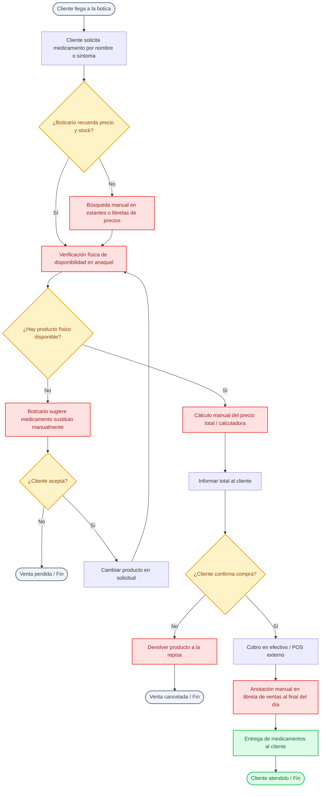
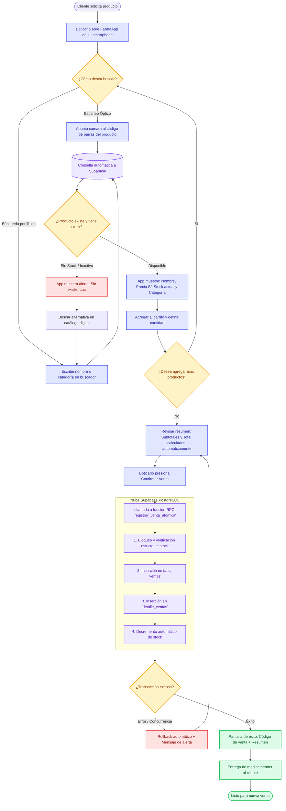

# FarmaApp - Análisis de Procesos de Negocio: AS-IS vs. TO-BE

## 1. Contexto Operativo y Diagnóstico

En el modelo operativo de las **pequeñas boticas y farmacias convencionales**, la atención al mostrador depende casi en su totalidad de procedimientos manuales, memorización de precios, libretas de control de stock y consultas físicas directas en los estantes.

### 1.1. Puntos Críticos del Proceso Actual (Dolores Operativos)
1. **Demora en Atención:** El boticario debe desplazarse físicamente o buscar en listas en papel para conocer el precio y la existencia del producto.
2. **Errores de Cálculo:** Cálculos manuales o en calculadoras de mano propensos a equivocaciones en el vuelto y en la sumatoria total.
3. **Descuadre de Inventario:** El stock se anota al final del día o no se registra de inmediato, provocando quiebres de stock no detectados (*out-of-stock*).
4. **Dependencia del Personal:** Si el boticario habitual se ausenta, el personal de reemplazo desconoce la ubicación y precios de los fármacos.

---

## 2. Diagrama de Proceso Actual (AS-IS)

El siguiente flujo representa la secuencia manual y fragmentada que sigue el personal de la botica ante la llegada de un cliente:



---

## 3. Diagrama de Proceso Optimizado (TO-BE con FarmaApp)

Con **FarmaApp**, el proceso se centraliza en un dispositivo móvil con lectura óptica de códigos de barra y sincronización inmediata con Supabase:



---

## 4. Matriz Comparativa: AS-IS vs. TO-BE

| Dimensión de Análisis | Proceso Manual (AS-IS) | Proceso FarmaApp (TO-BE) | Impacto / Beneficio |
| :--- | :--- | :--- | :--- |
| **Tiempo de Atención** | 3 a 6 minutos por cliente | **30 a 60 segundos** por cliente | Reducción de más del **75% del tiempo de espera** en cola |
| **Búsqueda de Información** | Desplazamiento físico y revisión de cuadernos | Escaneo instantáneo (< 200 ms) o búsqueda predictiva | Cero pérdida de tiempo en anaqueles |
| **Cálculo de Precios y Totales** | Manual / calculadora con riesgo de error | Automático y en tiempo real ($P \times Q$) | Eliminación de errores aritméticos en cobro |
| **Actualización de Stock** | Libreta manual al final del día o nula | **Decremento atómico en tiempo real** | Cero descuadres entre stock físico y lógico |
| **Control de Stock Mínimo** | Reactivo (cuando el producto se acaba en mostrador) | Alertas visuales inmediatas cuando $stock \le stock\_minimo$ | Reabastecimiento preventivo |
| **Trazabilidad de Ventas** | Tickets manuales extraviables | Registro permanente con UUID y código de venta | Historial auditable y estructurado |

---

## 5. Actores y Responsabilidades en el Proceso

```text
┌─────────────────────────┐         ┌─────────────────────────┐
│     CLIENTE FINAL       │         │   TRABAJADOR / BOTICARIO│
├─────────────────────────┤         ├─────────────────────────┤
│ • Solicita medicamentos │ ◄─────► │ • Escanea / Busca ítem  │
│ • Realiza el pago       │         │ • Agrega al carrito     │
│ • Recibe sus productos  │         │ • Confirma la venta     │
└─────────────────────────┘         └────────────┬────────────┘
                                                 │ HTTPS
                                                 ▼
                                    ┌─────────────────────────┐
                                    │    SUPABASE BACKEND     │
                                    ├─────────────────────────┤
                                    │ • Consulta catálogo     │
                                    │ • Valida existencias    │
                                    │ • Ejecuta RPC atómica   │
                                    └─────────────────────────┘
```
