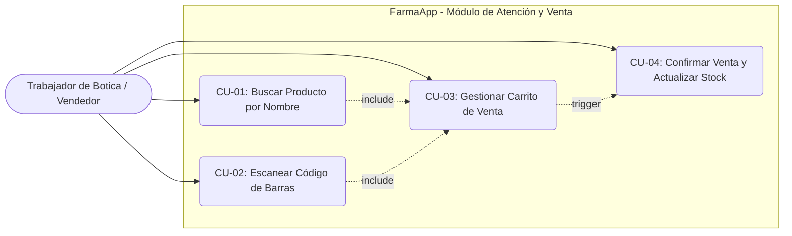

# FarmaApp - Especificación Detallada de Casos de Uso

Este documento describe formalmente los casos de uso para la primera entrega de **FarmaApp**, detallando precondiciones, secuencias de eventos, flujos alternativos y postcondiciones.

---

## 1. Diagrama General de Casos de Uso

---

## 2. Especificación de Casos de Uso

### CU-01: Buscar Producto por Nombre o Categoría

| Campo | Detalle |
| :--- | :--- |
| **Identificador** | **CU-01** |
| **Nombre** | Buscar Producto en Catálogo |
| **Actor Principal** | Trabajador de Botica / Vendedor |
| **Descripción** | Permite encontrar medicamentos o suministros ingresando texto en la barra de búsqueda para consultar precio y stock disponible. |
| **Precondición** | 1. La aplicación móvil se encuentra abierta en el dispositivo Android. 2. El dispositivo cuenta con acceso a internet (WiFi / Datos móviles) para consultar Supabase. |
| **Flujo Principal** | 1. El vendedor accede a la pantalla de **Búsqueda** o pulsa sobre la barra superior. 2. El vendedor ingresa un término de búsqueda (ej. *"Paracetamol"*, *"Alcohol"*, *"Caja"*). 3. La aplicación realiza la consulta con filtro `ilike` insensible a mayúsculas sobre la tabla `productos`. 4. El sistema muestra la lista de resultados con: Nombre, Categoría, Precio Unitario en Soles y Stock actual. 5. El vendedor pulsa sobre la tarjeta del producto o el botón de acción para ver el detalle. |
| **Flujo Alternativo 1A (Sin resultados)** | 1A.1. El término ingresado no coincide con ningún producto activo. 1A.2. La aplicación muestra una pantalla amigable con el mensaje: *"No se encontraron productos coincidentes"*, sugiriendo verificar la ortografía o escanear el código. |
| **Flujo Alternativo 1B (Error de red)** | 1B.1. El dispositivo pierde la conectividad con Supabase. 1B.2. La aplicación muestra un banner de advertencia: *"Sin conexión al servidor. Reintentando..."* con un botón de reintento manual. |
| **Postcondición** | El producto deseado es identificado y queda disponible para su incorporación al carrito de venta. |

---

### CU-02: Escanear Código de Barras con la Cámara

| Campo | Detalle |
| :--- | :--- |
| **Identificador** | **CU-02** |
| **Nombre** | Escanear Código de Barras Óptico |
| **Actor Principal** | Trabajador de Botica / Vendedor |
| **Descripción** | Utiliza la cámara trasera del smartphone para leer códigos de barras (Code 128 / EAN) e identificar el producto de forma inmediata. |
| **Precondición** | 1. El dispositivo cuenta con cámara física funcional. 2. La aplicación cuenta con permisos de acceso a la cámara otorgados por el usuario. |
| **Flujo Principal** | 1. El vendedor presiona el botón **"Escanear Código"** o el botón flotante con ícono de escáner. 2. La aplicación inicializa el visor de cámara con guía rectangular de encuadre. 3. El vendedor enfoca el código de barras (ej. `BOT-000001`) a una distancia de 15-25 cm. 4. El lector óptico decodifica los datos e identifica la cadena del código. 5. La aplicación emite una confirmación háptica/visual y consulta el registro en Supabase mediante `codigo_barras`. 6. La aplicación despliega automáticamente la tarjeta emergente del producto con su información y stock. 7. El vendedor selecciona la cantidad deseada y confirma para agregarlo al carrito. |
| **Flujo Alternativo 2A (Permiso de cámara denegado)** | 2A.1. El usuario no ha otorgado permisos de cámara a la aplicación. 2A.2. La aplicación muestra una vista explicativa: *"Se requiere permiso de cámara para escanear códigos de barra"* con un botón para abrir la configuración del sistema. |
| **Flujo Alternativo 2B (Código no registrado en la base de datos)** | 2B.1. El código de barras escaneado no existe en la tabla `productos`. 2B.2. La aplicación muestra una alerta: *"Código [BOT-XXXXXX] no registrado en el inventario"*, manteniendo la cámara activa para un nuevo intento. |
| **Flujo Alternativo 2C (Producto inactivo o sin stock)** | 2C.1. El producto existe pero tiene `stock = 0` o `activo = false`. 2C.2. La aplicación muestra la tarjeta con indicador rojo *"Agotado / Sin stock disponible"* e inhabilita el botón de agregar. |
| **Postcondición** | El producto es recuperado y presentado con datos exactos del inventario en tiempo real. |

---

### CU-03: Gestionar Carrito de Venta

| Campo | Detalle |
| :--- | :--- |
| **Identificador** | **CU-03** |
| **Nombre** | Gestionar Ítems y Cantidades en Carrito de Venta |
| **Actor Principal** | Trabajador de Botica / Vendedor |
| **Descripción** | Permite al vendedor revisar la lista de productos agregados, ajustar unidades, eliminar ítems y visualizar el cálculo automático del importe total. |
| **Precondición** | Se ha seleccionado al menos un producto mediante búsqueda (CU-01) o escaneo (CU-02). |
| **Flujo Principal** | 1. El vendedor accede a la vista del **Carrito / Venta Actual**. 2. El sistema lista los productos agregados mostrando: Nombre, Precio Unitario, Cantidad seleccionada y Subtotal. 3. El vendedor ajusta la cantidad requerida pulsando los controles **`+`** o **`-`**. 4. El sistema recalcula inmediatamente los subtotales y la sumatoria total en Soles (PEN). 5. El vendedor puede opcionalmente ingresar el nombre o DNI del cliente y seleccionar el método de pago (Efectivo, Yape, Tarjeta). |
| **Flujo Alternativo 3A (Intento de sobrepasar stock físico)** | 3A.1. El vendedor intenta aumentar la cantidad por encima del stock registrado ($cantidad > stock$). 3A.2. La aplicación bloquea el incremento y muestra una advertencia visual: *"Stock máximo alcanzado (X disponibles)"*. |
| **Flujo Alternativo 3B (Eliminar producto del carrito)** | 3B.1. El cliente decide no llevar uno de los productos. 3B.2. El vendedor presiona el ícono de papelera o desliza el ítem para removerlo. 3B.3. El sistema elimina el producto del carrito y actualiza el importe total. |
| **Flujo Alternativo 3C (Vaciar carrito por cancelación)** | 3C.1. El cliente cancela la compra completa. 3C.2. El vendedor presiona *"Limpiar Venta"*. 3C.3. El carrito vuelve a estado inicial vacío. |
| **Postcondición** | El carrito refleja con exactitud la intención de compra del cliente y el monto a cobrar. |

---

### CU-04: Confirmar Venta y Actualizar Inventario (Transacción Atómica)

| Campo | Detalle |
| :--- | :--- |
| **Identificador** | **CU-04** |
| **Nombre** | Confirmar Venta y Decrementar Stock Atómicamente |
| **Actor Principal** | Trabajador de Botica / Vendedor |
| **Descripción** | Ejecuta la transacción final de cobro, genera el registro de venta con sus detalles y descuenta el inventario en Supabase PostgreSQL de manera atómica (ACID). |
| **Precondición** | 1. El carrito contiene al menos un producto con cantidad válida. 2. El vendedor ha recibido la confirmación de pago por parte del cliente. |
| **Flujo Principal** | 1. El vendedor presiona el botón principal **"Confirmar Venta (S/ XX.XX)"**. 2. La aplicación invoca la función remota RPC `registrar_venta_atomica` en Supabase enviando el payload JSON con los ítems de la venta. 3. La función de base de datos ejecuta en una sola transacción: &nbsp;&nbsp;&nbsp;&nbsp;a) Bloqueo de filas (`FOR UPDATE`) y verificación de stock para cada producto. &nbsp;&nbsp;&nbsp;&nbsp;b) Inserción del comprobante en la tabla `ventas` con código único autogenerado. &nbsp;&nbsp;&nbsp;&nbsp;c) Inserción de cada línea en `detalle_ventas`. &nbsp;&nbsp;&nbsp;&nbsp;d) Actualización y decremento del stock en `productos`. 4. Supabase confirma la transacción con éxito y devuelve el código de venta y resumen. 5. La aplicación presenta la pantalla de **Venta Exitosa** con el código generado (ej. `VTA-20260925-ABCD`) y el total recaudado. 6. El carrito se vacía automáticamente y el sistema queda listo para una nueva atención. |
| **Flujo Alternativo 4A (Conflicto de concurrencia o stock insuficiente durante confirmación)** | 4A.1. Otro vendedor o proceso vendió las últimas unidades milisegundos antes. 4A.2. La función RPC aborta la transacción (`ROLLBACK`), evitando stock negativo. 4A.3. La aplicación notifica: *"Error: Stock insuficiente para el producto [Nombre]. Por favor actualice el carrito"*, refrescando el catálogo local. |
| **Flujo Alternativo 4B (Fallo de comunicación durante la llamada RPC)** | 4B.1. Se interrumpe la conexión durante la confirmación. 4B.2. El cliente de Supabase captura el error de red y muestra un diálogo con opción de **Reintentar Transacción** sin perder los ítems del carrito. |
| **Postcondición** | La venta queda asentada en la base de datos, el inventario se decrementa y el comprobante histórico queda generado. |
